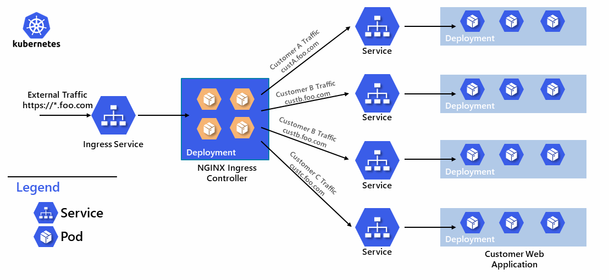

# Azure ACS Hybrid Cluster for Migrating to the Cloud

Guide demonstrating use of an Azure ACS hybrid windows/linux cluster for migrating single-tenant .Net 4.7 apps to the multi-tenant cloud.

## Introduction

Many enterprises and software companies are in the process of undergoing dramatic [digital transformation](https://enterprise.microsoft.com/en-us/digital-transformation/). 

> Digital transformation is about reimagining how you bring together people, data, and processes to create value for your customers and maintain a competitive advantage in a digital-first world. <sup>[1](#footnote1)</sup>

As part of this transformation, many ISV's are challenged with moving from packaged, on-premises software to multi-tenant, cloud-hosted, software-as-a-service. For many companies, including those who have invested heavily in ASP.net, this migration to the cloud requires not only enormous transformation of the business, but also significant investment in their software stack. For many, scrapping the old system and starting over simply is not possible due to the size and complexity of the applications.

[Cesar de la Torre](https://blogs.msdn.microsoft.com/cesardelatorre/) has written an entire book titled **Modernize existing .NET applications with Azure cloud and Windows Containers** available for free from the [.NET Architecture Center](https://www.microsoft.com/net/learn/architecture). This book covers much of the basics of how to modernize a single application. I highly recommend study of this valuable resource as your prepare for your own migration. 

The guide in this repository is targeted toward ISVs who need to migrate their single-tenant applications to the cloud with minimal changes while enabling them to support multiple tenants/customers on a single Azure Container Services cluster.

# Key Goals

The key goals of this guide are as follows

- [ ] Demonstrate a technique to apply environment settings to a .NET 4.5 application as described in the [Twelve-Factor App config reference](https://12factor.net/config).
- [ ] Create a hybrid Windows/Linux Kubernetes cluster in Azure Container Services.
- [ ] Deploy Windows containers to an ACS Kubernetes cluster.
- [ ] Create and secure a Linux NGINX ingress controller.
- [ ] Route traffic from multiple customers to the correct applications. 
- [ ] Allow each customer-specific application to be upgraded independently or in bulk.

## Our goal, illustrated




## Reference Application

This guide will use as the reference application a simple ASP.NET 4.5 application created by @spboyer. My modified version introduces configuration changes through the use of Environment Variables. You can clone the repository from here: [dougperkes/MVCRandomAnswerGenerator](https://github.com/dougperkes/MVCRandomAnswerGenerator).

# Applying environment settings to an ASP.NET application

> An app’s config is everything that is likely to vary between deploys (staging, production, developer environments, etc). This includes:
>
> * Resource handles to the database, Memcached, and other backing services
> * Credentials to external services such as Amazon S3 or Twitter
> * Per-deploy values such as the canonical hostname for the deploy
>
> Apps sometimes store config as constants in the code. This is a violation of twelve-factor, which requires strict separation of config from code. Config varies substantially across deploys, code does not.
>
> [Twelve-Factor App - III Config](https://12factor.net/config)

Traditionally configuration for ASP.NET 4.x is done through web.config changes. However, web.config changes aren't the best solution for containerized applications. My MVCRandomAnswerGenerator implements the following to allow config data to be read from the environment settings.

```csharp
public class Env
{
    private static Dictionary<string, string> _Values = new Dictionary<string, string>();
    public static string Version => System.Reflection.Assembly.GetExecutingAssembly().GetName().Version.ToString();
    public static string CustomerName => Get("CM_CUSTOMER_NAME");
    public static string LogoUrl => Get("CM_LOGO_URL");
    public static string DbName => Get("CM_DATABASE_NAME");

    private static string Get(string variable)
    {
        if (!_Values.ContainsKey(variable))
        {
            var value = Environment.GetEnvironmentVariable(variable);
            _Values[variable] = value;
        }
        return _Values[variable];
    }

}
```    
Using these configuration settings, our app will end up looking like the following, the yellow box representing the settings coming from the Environment and the red is the version of the current assembly for the app.


# Building a hybrid ACS cluster

## Prerequisites

Before we start building the cluster, we need a few prerequisites to be installed.

1. Azure subscription. See [Experiment with Azure for FREE!](https://blogs.msdn.microsoft.com/dotnet/2017/10/19/experiment-with-azure-for-free/) if you don't already have one.
1. [Windows 10 bash shell](https://msdn.microsoft.com/en-us/commandline/wsl/about) or equivalent Unix shell (OSX, Ubuntu, etc). 
1. [Azure CLI 2.0 ](https://docs.microsoft.com/en-us/cli/azure/install-azure-cli?view=azure-cli-latest)
1. If you want to use a real, valid SSL certificate, you'll need to obtain a wildcard cert. We will use a self-signed certificate for demo purposes.

## Create the ACS cluster

We will be using a resource manager template that I've borrow and modifed from [bucksteamy/kubernetes-demos](https://github.com/bucksteamy/kubernetes-demos/tree/master/acs-rps-win%2Blinuxpools%2Bmanagedisks). This template, in the [arm](arm) directory, will create a hybrid Windows + Linux cluster in ACS using the Kubernetes orchestrator.

> The following commands will all be run in your bash shell.

First we need to find our Azure  subscription id
```bash
az login
```
The results of this command will be a list of the subscriptions you have access to. Find the `id` of the subscription you want to use replace `mySubscriptionID` with your value in the following commands.

Before we can create an ACS cluster we need Service Principal which ACS will use to interact with the Azure API. See [Set up an Azure AD service principal for a Kubernetes cluster in Container Service](https://docs.microsoft.com/en-us/azure/container-service/kubernetes/container-service-kubernetes-service-principal) for more detail.

```bash
az account set --subscription "mySubscriptionID"

az ad sp create-for-rbac --role="Contributor" --scopes="/subscriptions/mySubscriptionID"
```

The results of this command will be a json blob similar to the following:
```json
{
  "appId": "[your app id here]",
  "displayName": "azure-cli-2017-10-20-23-10-13",
  "name": "http://azure-cli-2017-10-20-23-10-13",
  "password": "[your password here]",
  "tenant": "[your tenant here]"
}
```
Record the appID and password for future use when we create the cluster.

We now are ready to create the cluster. CD in your bash shell to the `arm` directory of this repository.

> Note: If you are running on windows and you have cloned this repository to c:\dev\sample you can move to that directory in the Bash shell by running `cd /mnt/c/dev/sample/arm`.

```bash
GROUP="[your resource group name, i.e. my-cluster-group]"
ACSNAME="[your acs cluster name, i.e. hybrid-cluster]"
WINPASSWORD="[create a secure password for windows machines]"
APPID="[app id for service principal created above]"
APPPW="[app password for service principal created above]"
MYSSHKEY="$(cat ~/.ssh/id_rsa.pub)"

# Create the Azure Resource Group
az group create --name $GROUP --location "westus2"

# Create the ACS Cluster
az group 
```

# Endnotes
**<a name="footnote1">1</a>:** “Digital Transformation - Microsoft Enterprise.” *Microsoft Enterprise*, Microsoft Corporation, 20 Oct. 2017, enterprise.microsoft.com/en-us/digital-transformation/.
