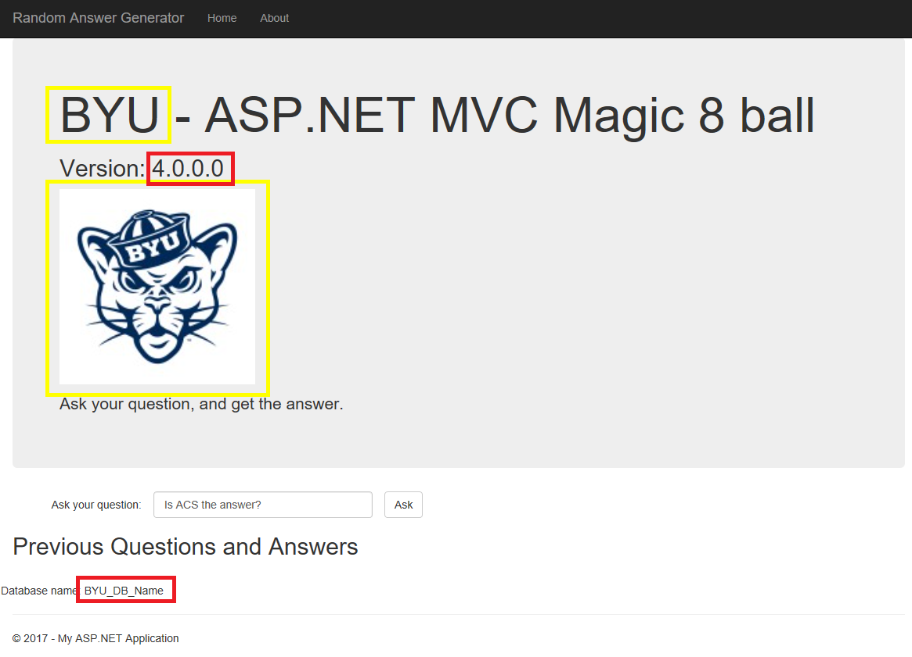
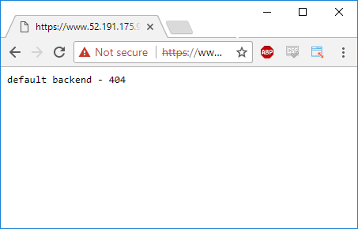

# Azure ACS Hybrid Cluster for Migrating to the Cloud

Guide demonstrating use of an Azure ACS hybrid windows/linux cluster for migrating single-tenant .Net 4.7 apps to the multi-tenant cloud.

## Introduction

Many enterprises and software companies are in the process of undergoing dramatic [digital transformation](https://enterprise.microsoft.com/en-us/digital-transformation/). 

> Digital transformation is about reimagining how you bring together people, data, and processes to create value for your customers and maintain a competitive advantage in a digital-first world. <sup>[1](#footnote1)</sup>

As part of this transformation, many ISV's are challenged with moving from packaged, on-premises software to multi-tenant, cloud-hosted, software-as-a-service. For many companies, including those who have invested heavily in ASP.net, this migration to the cloud requires not only enormous transformation of the business, but also significant investment in their software stack. For many, scrapping the old system and starting over simply is not possible due to the size and complexity of the applications.

[Cesar de la Torre](https://blogs.msdn.microsoft.com/cesardelatorre/) has written an entire book titled **Modernize existing .NET applications with Azure cloud and Windows Containers** available for free from the [.NET Architecture Center](https://www.microsoft.com/net/learn/architecture). This book covers much of the basics of how to modernize a single application. I highly recommend study of this valuable resource as your prepare for your own migration. 

The guide in this repository is targeted toward ISVs who need to migrate their single-tenant applications to the cloud with minimal changes while enabling them to support multiple tenants/customers on a single Azure Container Services cluster.

# Key Goals

The key goals of this guide are as follows

- [ ] Demonstrate a technique to apply environment settings to a .NET 4.5 application as described in the [Twelve-Factor App config reference](https://12factor.net/config).
- [ ] Create a hybrid Windows/Linux Kubernetes cluster in Azure Container Services.
- [ ] Deploy Windows containers to an ACS Kubernetes cluster.
- [ ] Create and secure a Linux NGINX ingress controller.
- [ ] Route traffic from multiple customers to the correct applications. 
- [ ] Allow each customer-specific application to be upgraded independently or in bulk.

## Our goal, illustrated


## Reference Application

This guide will use as the reference application a simple ASP.NET 4.5 application created by @spboyer. My modified version introduces configuration changes through the use of Environment Variables. You can clone the repository from here: [dougperkes/MVCRandomAnswerGenerator](https://github.com/dougperkes/MVCRandomAnswerGenerator).

# Applying environment settings to an ASP.NET application

> An app’s config is everything that is likely to vary between deploys (staging, production, developer environments, etc). This includes:
>
> * Resource handles to the database, Memcached, and other backing services
> * Credentials to external services such as Amazon S3 or Twitter
> * Per-deploy values such as the canonical hostname for the deploy
>
> Apps sometimes store config as constants in the code. This is a violation of twelve-factor, which requires strict separation of config from code. Config varies substantially across deploys, code does not.
>
> [Twelve-Factor App - III Config](https://12factor.net/config)

Traditionally configuration for ASP.NET 4.x is done through web.config changes. However, web.config changes aren't the best solution for containerized applications. My MVCRandomAnswerGenerator implements the following to allow config data to be read from the environment settings.

```csharp
public class Env
{
    private static Dictionary<string, string> _Values = new Dictionary<string, string>();
    public static string Version => System.Reflection.Assembly.GetExecutingAssembly().GetName().Version.ToString();
    public static string CustomerName => Get("CM_CUSTOMER_NAME");
    public static string LogoUrl => Get("CM_LOGO_URL");
    public static string DbName => Get("CM_DATABASE_NAME");

    private static string Get(string variable)
    {
        if (!_Values.ContainsKey(variable))
        {
            var value = Environment.GetEnvironmentVariable(variable);
            _Values[variable] = value;
        }
        return _Values[variable];
    }

}
```    
Using these configuration settings, our app will end up looking like the following, the yellow box representing the settings coming from the Environment and the red is the version of the current assembly for the app.



# Building a hybrid ACS cluster

## Prerequisites

Before we start building the cluster, we need a few prerequisites to be installed.

1. Azure subscription. See [Experiment with Azure for FREE!](https://blogs.msdn.microsoft.com/dotnet/2017/10/19/experiment-with-azure-for-free/) if you don't already have one.
1. [Windows 10 bash shell](https://msdn.microsoft.com/en-us/commandline/wsl/about) or equivalent Unix shell (OSX, Ubuntu, etc). 
1. [Azure CLI 2.0 ](https://docs.microsoft.com/en-us/cli/azure/install-azure-cli?view=azure-cli-latest)
1. If you want to use a real, valid SSL certificate, you'll need to obtain a wildcard cert. We will use a self-signed certificate for demo purposes.

## Create the ACS cluster

We will be using a resource manager template that I've borrow and modifed from [bucksteamy/kubernetes-demos](https://github.com/bucksteamy/kubernetes-demos/tree/master/acs-rps-win%2Blinuxpools%2Bmanagedisks). This template, in the [arm](arm) directory, will create a hybrid Windows + Linux cluster in ACS using the Kubernetes orchestrator.

> The following commands will all be run in your bash shell.

First we need to find our Azure  subscription id
```bash
az login
```
The results of this command will be a list of the subscriptions you have access to. Find the `id` of the subscription you want to use replace `mySubscriptionID` with your value in the following commands.

Before we can create an ACS cluster we need Service Principal which ACS will use to interact with the Azure API. See [Set up an Azure AD service principal for a Kubernetes cluster in Container Service](https://docs.microsoft.com/en-us/azure/container-service/kubernetes/container-service-kubernetes-service-principal) for more detail.

```bash
az account set --subscription "mySubscriptionID"

az ad sp create-for-rbac --role="Contributor" --scopes="/subscriptions/mySubscriptionID"
```

The results of this command will be a json blob similar to the following:
```json
{
  "appId": "[your app id here]",
  "displayName": "azure-cli-2017-10-20-23-10-13",
  "name": "http://azure-cli-2017-10-20-23-10-13",
  "password": "[your password here]",
  "tenant": "[your tenant here]"
}
```
Record the appID and password for future use when we create the cluster.

We now are ready to create the cluster. CD in your bash shell to the `arm` directory of this repository.

> Note: If you are running on windows and you have cloned this repository to c:\dev\sample you can move to that directory in the Bash shell by running `cd /mnt/c/dev/sample/arm`.

```bash
GROUP="[your resource group name, i.e. my-cluster-group]"
ACSNAME="[your acs cluster name, i.e. hybrid-cluster]"
WINPASSWORD="[create a secure password for windows machines]"
APPID="[app id for service principal created above]"
APPPW="[app password for service principal created above]"
MYSSHKEY="$(cat ~/.ssh/id_rsa.pub)"

# Create the Azure Resource Group
az group create --name $GROUP --location "westus2"

# Create the ACS Cluster
az group deployment create -g $GROUP --template-file deployment.json --parameters @params.kubernetes.json --parameters windowsAgentAdminPassword="$WINPASSWORD" servicePrincipalClientId="$APPID" servicePrincipalClientSecret="$APPPW" sshRSAPublicKey="$MYSSHKEY" masterDnsNamePrefix="$ACSNAME"
```

Creation of the ACS cluster will take several minutes. When complete, run the following command to verify cluster creation and to view the name of the cluster:
```bash
az acs list --output table
```

With the name of the cluster you can now retrieve the credentials to connect to it with `kubectl`. First, let's make sure `kubectl` is installed and then grab the credentials:
```bash
az acs kubernetes install-cli

# Get the credentials, see note below
az acs kubernetes get-credentials --resource-group $GROUP --name [your ACS cluster name]
```

> Note: Depending on the version of the Azure CLI you have, you may receive an error when running the `get-credentials` command. If you run into this you can retrieve the credentials by doing the following.

#### Alternative method for retrieving credentials

You may also retrieve the credentials needed to connect to the cluster by running an `scp` command. First we need the URL of the cluster.

```bash
az acs list --query "[].masterProfile.fqdn | [0]"
```

Now with the URL we can retrieve the credentials:
```bash
scp azureuser@[ your cluster url here ]:.kube/config ~/.kube/config
```

## Get information about the ACS Kubernetes cluster
With the credentials in place we can now use the `kubectl` command to connect to the Kubernetes cluster and retrieve information. Try the following commands to start exploring your cluster.

```bash
kubectl get nodes
kubectl get services # On a new cluster this should return a single kubernetes service.
kubectl get pods # Should return "No resources found"
kubectl --help
```


## Deploying Pods and Services to the cluster

Now that you have a running cluster and are able to connect to it with `kubectl`, you can start creating pods and services. All of the sample files we will be using are found in the `k8s` directory of this repository.

### Default HTTP Backend

The first pod and service we are going to create is a default http backend. These will serve as default catch-all for any traffic that goes through our ingress controller that does not match any of the rules.

For this step we will use a sample backend created by Google that returns a 404 Not Found error on the root path `/` and a 200 OK on the `/healthz` path.

Take a few minutes to review the [k8s/default.yaml](k8s/default.yaml) file. This file creates two resources in the Kubernetes cluster. 

1. First, a Deployment is created named `default-http-backend` containing 2 replicates of a pod. The pod consists of a single container created from the image `gcr.io/google_containers/defaultbackend:1.0`. Make special note of the `nodeSelector` property with the value `beta.kubernetes.io/os: linux`. This ensures that this pod is only deployed on Linux nodes within the cluster.
1. Second, we create a service, also named `default-http-backend` which exposes port 80 on a cluster IP address. The service will forward traffic to port 8080 on the pods.

Create the default backend by running the following:
```bash
kubectl apply -f default.yaml
```

Now run the following commands to explore what has been created:
```bash
kubectl get services
kubectl get pods
```

### Ingress Service and Certificate

For the purposes of this guide, we are going to secure our web sites with a self-signed wildcard certificate. For production purposes you will need to acquire a real wildcard certificate. We will also utilize the [xip.io](http://xip.io/) service so that we don't have to manage any DNS entries.

xip.io requires us to have an public IP address which we will get by created a LoadBalancer service in Kubernetes.

Review the `ingress-service.yaml`, then run the following to create the service without any backing pods. We will create the pods via a deployment once we have our TLS certificate:
```bash
kubectl apply -f ingress-service.yaml
```

Now we need to wait for a public IP address to be defined. Run the following and wait until an EXTERNAL-IP address is assigned to the nginx-ingress-svc.
```bash
kubectl get services -w
```
The results will appear as follows:
```
NAME                   TYPE           CLUSTER-IP     EXTERNAL-IP   PORT(S)         AGE
default-http-backend   ClusterIP      10.0.147.197   <none>        80/TCP          5m
kubernetes             ClusterIP      10.0.0.1       <none>        443/TCP         24m
nginx-ingress-svc      LoadBalancer   10.0.21.160    <pending>     443:32509/TCP   7s
nginx-ingress-svc   LoadBalancer   10.0.21.160   52.191.175.92   443:32509/TCP   3m
```

#### Create a certificate and Kubernetes secret

Now that the ingress service is running and a public IP address is available, we can create a self-signed wildcard cert for the xip.io domain.

Run the following command. You will be prompted to provide some information about yourself. The most important value to provide is the `Common Name`. **You must input** the following: `*.[your EXTERNAL-IP].xip.io`.

```bash
openssl req -x509 -nodes -newkey rs4096 -keyout key.pem -out cert.pem -days 365
```

Here's my sample input that I used:
```
Country Name (2 letter code) [AU]:US
State or Province Name (full name) [Some-State]:AZ
Locality Name (eg, city) []:Peoria
Organization Name (eg, company) [Internet Widgits Pty Ltd]:
Organizational Unit Name (eg, section) []:
Common Name (e.g. server FQDN or YOUR name) []:*.52.191.175.92.xip.io
Email Address []:
```

You will now have a cert.pem and a key.pem file in your directory. We will now use these files to create a Kubernetes TLS secret named `xipio-tls-cert` which we will reference in our YAML files to secure access to our web services.

Run the following:
```bash
kubectl create secret tls xipio-tls-cert --key key.pem --cert cert.pem
```
## Deploy the Ingress Controller Pods

With a Kubernetes TLS secret in place, we can now deploy our NGINX Ingress controllor pods and test the default site. Examine the [k8s/ingress.yaml](k8s/ingress.yaml) file, noting the container image, args, and nodeSelector. This pod will only be deployed on Linux nodes in the cluster. Run the following:

```bash
kubectl apply -f ingress.yaml
```

Run `kubectl get pods` to ensure that your new nginx-ingress-controller-* pods are running.

With the ingress controller pods running we should be able to test our initial setup. Open `https://www.[your EXTERNAL-IP].xip.io` in a web browser. You will get a big certificate warning because we are using a self-signed certificate which you need to bypass. In Chrome, click Advanced then the _Proceed to www.[your EXTERNAL-IP].xip.io (unsafe)_ link.

If everything has gone according to plan, you will receive a page that looks like this:



Add `/healthz` to the URL and you will receive the following:


# Cleaning up your cluster

When you are done playing, you may want to delete your resource group containing your cluster.

```bash
az group delete -g $GROUP
```

# Endnotes
**<a name="footnote1">1</a>:** “Digital Transformation - Microsoft Enterprise.” *Microsoft Enterprise*, Microsoft Corporation, 20 Oct. 2017, enterprise.microsoft.com/en-us/digital-transformation/.
